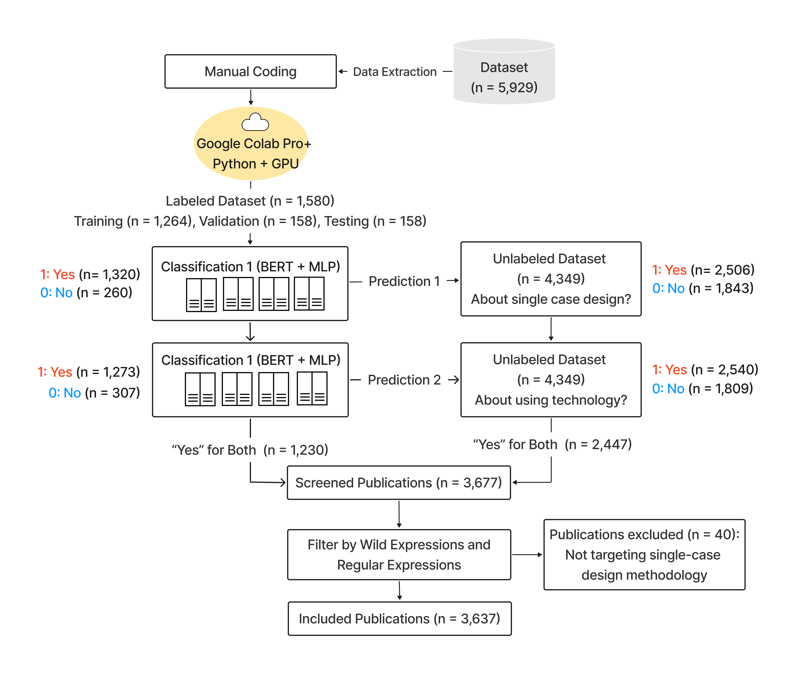
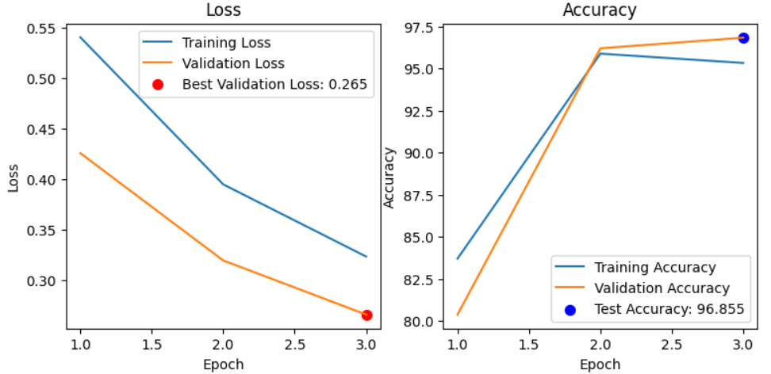
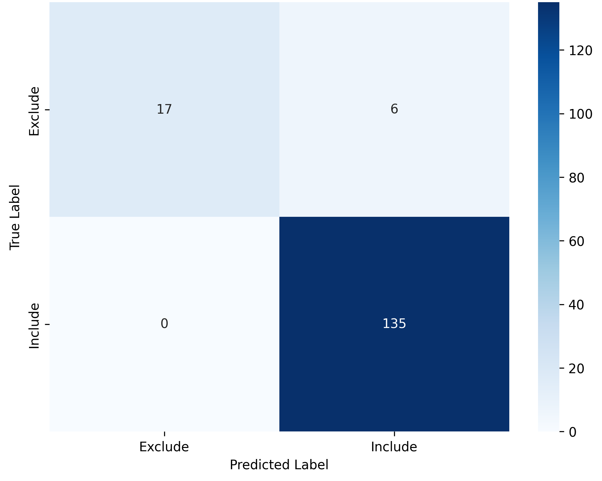
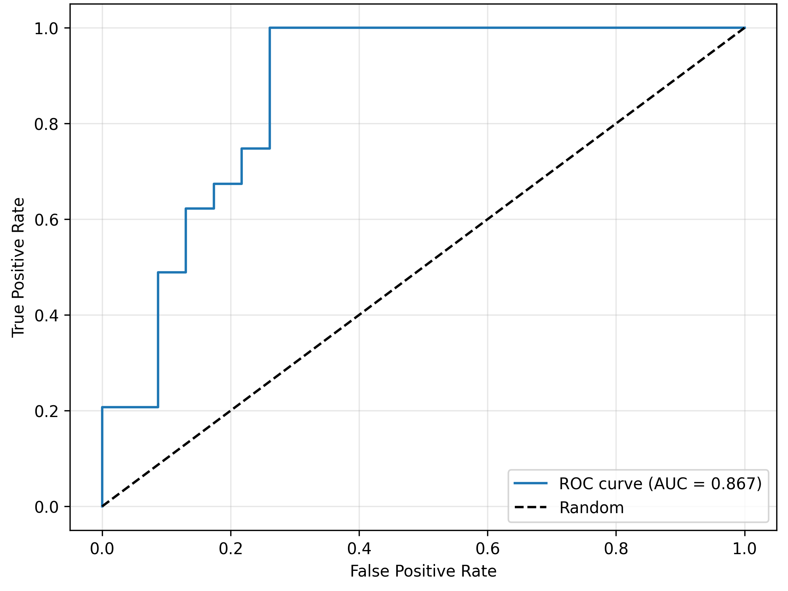
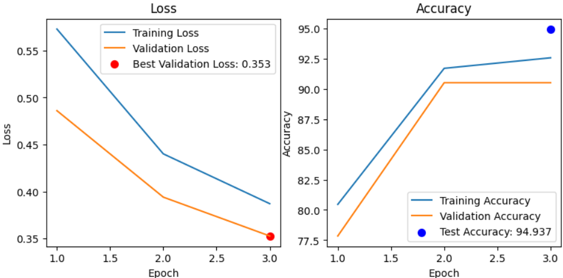
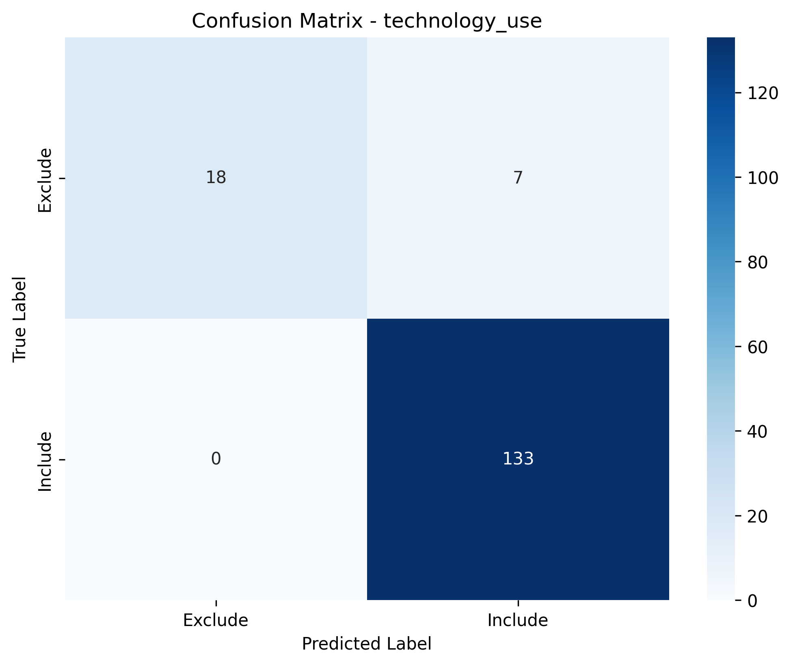
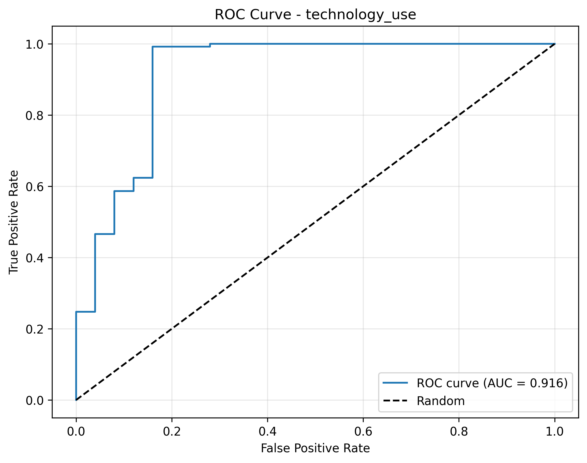

```{r setup, include=FALSE}
knitr::opts_chunk$set(echo = TRUE, warning = FALSE)
```

```{=html}
<link rel="stylesheet" href="https://cdnjs.cloudflare.com/ajax/libs/font-awesome/6.4.0/css/all.min.css">
  
  <style>
.hover-effect:hover {
  color: #2B6CB0 !important;
    transition: color 0.3s ease;
}

.responsive-iframe {
  width: 100% !important;
  height: auto;
  min-height: 400px;
  max-width: 100%;
}

.iframe-container {
  position: relative;
  width: 100%;
  padding-bottom: 56.25%; 
    height: 0;
}

.iframe-container iframe {
  position: absolute;
  top: 0;
  left: 0;
  width: 100%;
  height: 100%;
  border: 0;
}

.iframe-container.scrollable {
    padding-bottom: 0 !important;
    height: auto !important;
    max-height: 70vh !important;
    overflow-y: auto !important;
    position: relative !important;
}

.iframe-container.scrollable iframe {
    position: relative !important;
    width: 100% !important;
    height: 100% !important;
    min-height: 400px !important;
}

@media (max-width: 768px) {
  .iframe-container.scrollable {
    max-height: 50vh !important;
    overflow-y: auto !important;
  }
  .iframe-container {
    padding-bottom: 75%; 
  }
}

@media (max-width: 480px) {
  .responsive-iframe {
    min-height: 200px;
  }
  .iframe-container {
    padding-bottom: 100%;
  }
  .iframe-container.scrollable {
    max-height: 40vh !important;
    overflow-y: auto !important;
  }
}
</style>
```

# Pipeline



# Screening

### Search Strategy

[View search terms](search_terms/index.html)

[Web of Science (All Fields): **Single-case design** (18 terms) AND **technology terms** (49 terms)]{style="background-color: #EBECF0; padding: 5px; border-left: 3px solid #949494; display: inline-block; margin: 10px 0;"}

### Setup Environment

```{r}
#| code-fold: false
suppressPackageStartupMessages({
  library(tidyverse)
  library(knitr)
  library(readxl)
  library(data.table)
  library(broom.mixed)
  library(DT)
  library(bibliometrix)
  library(openxlsx)
  library(sf)
  library(rnaturalearth)
  library(ggrepel)
  library(ggiraph)
  library(stringi)
  library(brms)
  library(performance)
  library(visNetwork)
  library(htmltools)
  library(RColorBrewer)
  library(flextable)
})

load("evolution/bayes_model.RData")
```

### Extract Web of Science (WoS) Data

```{r, eval=FALSE}
#| code-fold: false
wos_1_500 <- convert2df("1_500.ciw", dbsource = "wos", format = "endnote")
wos_501_1000 <- convert2df("501_1000.ciw", dbsource = "wos", format = "endnote")
wos_1001_1500 <- convert2df("1001_1500.ciw", dbsource = "wos", format = "endnote")
wos_1501_2000 <- convert2df("1501_2000.ciw", dbsource = "wos", format = "endnote")
wos_2001_2500 <- convert2df("2001_2500.ciw", dbsource = "wos", format = "endnote")
wos_2501_3000 <- convert2df("2501_3000.ciw", dbsource = "wos", format = "endnote")
wos_3001_3500 <- convert2df("3001_3500.ciw", dbsource = "wos", format = "endnote")
wos_3501_4000 <- convert2df("3501_4000.ciw", dbsource = "wos", format = "endnote")
wos_4001_4500 <- convert2df("4001_4500.ciw", dbsource = "wos", format = "endnote")
wos_4501_5000 <- convert2df("4501_5000.ciw", dbsource = "wos", format = "endnote")
wos_5001_5500 <- convert2df("5001_5500.ciw", dbsource = "wos", format = "endnote")
wos_5501_5935 <- convert2df("5501_5935.ciw", dbsource = "wos", format = "endnote")
```

```{r, eval=FALSE}
wos_5935 <- bind_rows(wos_1_500,
                       wos_501_1000,
                       wos_1001_1500,
                       wos_1501_2000,
                       wos_2001_2500,
                       wos_2501_3000,
                       wos_3001_3500,
                       wos_3501_4000,
                       wos_4001_4500,
                       wos_4501_5000,
                       wos_5001_5500,
                       wos_5501_5935)

wos <- wos_5935 %>% 
  filter(PY >= 1970)

write.csv(wos, "init_all_data.csv", row.names = FALSE)
```

### Model Training and Validation for Document Classification Tasks

A Transformer-MLP classifier ([pubmlp](https://github.com/mshin77/pubmlp)) combined transformer embeddings with categorical and numeric features for binary classification. The model was trained on human-labeled records and used to predict labels for unlabeled records. Classification was performed sequentially: first for single-case design, then for technology use.

#### `Step 1. Text classification for single-case design`

[<i class="fas fa-code"></i> Code](single_case/index.html){.hover-effect style="color: #6D6D6D; text-decoration: none;"}

{alt="Figure 2 (a). Training Loss and Accuracy"}

::: {layout-ncol="2"}



:::

#### `Step 2. Text classification for technology use`

[<i class="fas fa-code"></i> Code](technology_use/index.html){.hover-effect style="color: #6D6D6D; text-decoration: none;"}



::: {layout-ncol="2"}



:::

#### `Step 3. Filtering studies including methodology content`

[<i class="fas fa-code"></i> Code](methodology/index.html){.hover-effect style="color: #6D6D6D; text-decoration: none;"}

-   Employed a list of **77 wild expressions**, composed with **regular expressions** to process the data.
-   See Code to get the full list of methodology-related terms.

# Bibliometrics

### Main Findings

```{r, eval=FALSE}
data <- read.xlsx("../data/df.xlsx")

data <- data %>% filter(filtered == "Yes")

data_descriptive <- data %>%
  dplyr::mutate(Study = paste("study", row_number(), sep = "")) %>%
  dplyr::mutate(document = paste(Study, PY, sep = "_")) %>%
  ungroup()

data_descriptive <- data_descriptive %>%
  dplyr::select(document, everything())

data_descriptive$DT <- case_when(
  data_descriptive$DT == "ARTICLE" ~ "Article",
  data_descriptive$DT == "BOOK CHAPTER" ~ "Book Chapter",
  data_descriptive$DT == "ARTICLE; BOOK CHAPTER" ~ "Book Chapter",
  data_descriptive$DT == "REVIEW; BOOK CHAPTER" ~ "Book Chapter",
  data_descriptive$DT == "ARTICLE; DATA PAPER" ~ "Article",
  data_descriptive$DT == "EARLY ACCESS" ~ "Early Access",
  data_descriptive$DT == "ARTICLE; EARLY ACCESS" ~ "Article",
  data_descriptive$DT == "REVIEW; EARLY ACCESS" ~ "Review",
  data_descriptive$DT == "PROCEEDINGS PAPER" ~ "Proceeding Paper",
  data_descriptive$DT == "ARTICLE; PROCEEDINGS PAPER" ~ "Article",
  data_descriptive$DT == "REVIEW" ~ "Review",
  data_descriptive$DT == "EDITORIAL MATERIAL" ~ "Editorial Material",
  data_descriptive$DT == "MEETING ABSTRACT" ~ "Meeting Abstract",
  TRUE ~ as.character(data_descriptive$DT)
)

source_hindex <- bibliometrix::Hindex(data_descriptive, years = Inf, field = "source")$H
source_hindex$SO <- source_hindex$Element
source_hindex$m_index <- round(source_hindex$m_index, 2)

source_TC <- data_descriptive %>%
  dplyr::group_by(SO) %>%
  dplyr::summarize(total_citation = sum(TC)) %>%
  dplyr::mutate(total_citation_percent = round((total_citation / sum(total_citation) * 100),2)) %>%
  ungroup()

source_TP <- data_descriptive %>%
  dplyr::group_by(SO) %>%
  dplyr::summarize(publication_number = n()) %>%
  dplyr::mutate(publication_number_percent = round((publication_number / sum(publication_number) * 100),2)) %>%
  ungroup()

source_detail <- left_join(source_TC, source_TP, by = "SO")

source_detail <- source_detail %>%
  group_by(SO) %>%
  dplyr::mutate(citation_per_publication = round((total_citation / publication_number),0))

source_detail <- source_detail %>% arrange(desc(total_citation), desc(publication_number))
source_combined <- left_join(source_detail, source_hindex, by = "SO")
source_combined <- source_combined %>%
  arrange(desc(total_citation), desc(publication_number)) %>%
  select(SO, PY_start, publication_number, publication_number_percent,
         total_citation, total_citation_percent,
         citation_per_publication,
         h_index, g_index, m_index)


write.xlsx(source_combined, file = "files/source_combined.xlsx", colNames = TRUE)

results <- biblioAnalysis(data_descriptive)
descriptive_summary <- summary(results, k=71, pause=F, width=130)
MainInformationDF <- descriptive_summary$MainInformationDF

write.xlsx(MainInformationDF, file = "files/MainInformationDF.xlsx", colNames = TRUE)

MostProdCountries <- descriptive_summary$MostProdCountries

write.xlsx(MostProdCountries, file = "files/MostProdCountries.xlsx", colNames = TRUE)

TCperCountries <- descriptive_summary$TCperCountries

write.xlsx(TCperCountries, file = "files/TCperCountries.xlsx", colNames = TRUE)
```

```{r, echo=FALSE}
MainInformationDF <- read_excel("files/MainInformationDF.xlsx")

DT::datatable(
  MainInformationDF,
  options = list(
    dom = 'Bfrtip',
    buttons = c('copy', 'csv', 'excel', 'pdf'),
    pageLength = 10,
    scrollX = TRUE
  ),
  extensions = 'Buttons',
  class = "cell-border stripe",
  rownames = FALSE
)
```

### Map Publications and Citations Across Countries

```{r, eval=FALSE}
MostProdCountries <- MostProdCountries %>%
  mutate(
    Articles = as.numeric(Articles),
    Freq = as.numeric(Freq),
    SCP = as.numeric(SCP),
    MCP = as.numeric(MCP),
    MCP_Ratio = as.numeric(MCP_Ratio)
  )

TCperCountries <- TCperCountries %>%
  mutate(
    `Total Citations` = as.numeric(`Total Citations`),
    `Average Article Citations` = as.numeric(`Average Article Citations`)
  )

colnames(TCperCountries) <- stringr::str_trim(colnames(TCperCountries))

Countries_Prod_TC <- MostProdCountries %>%
  left_join(TCperCountries, by = "Country")

Countries_Prod_TC <- Countries_Prod_TC %>%
  mutate(Country = str_trim(Country, "both") %>% str_to_title())

Countries_Prod_TC <- Countries_Prod_TC %>%
  mutate(Country = case_when(
    Country == "Usa" ~ "USA",
    Country == "Korea" ~ "South Korea",
    Country == "U Arab Emirates" ~ "UAE",
    Country == "United Kingdom" ~ "UK",
    TRUE ~ as.character(Country)
  ))

write.xlsx(Countries_Prod_TC, file = "files/Countries_Prod_TC.xlsx", colNames = TRUE)

sf::sf_use_s2(TRUE)

world <- ne_countries(scale = "small", returnclass = "sf")

world <- world %>%
  mutate(admin = case_when(
    admin == "United States of America" ~ "USA",
    admin == "United Arab Emirates" ~ "UAE",
    admin == "United Kingdom" ~ "UK",
    admin == "United Republic of Tanzania" ~ "Tanzania",
    admin == "Republic of Serbia" ~ "Serbia",
    TRUE ~ as.character(admin)
  ))

wintr_proj <- "+proj=wintri +datum=WGS84 +no_defs +over"

if (is.na(st_crs(world))) {
  st_crs(world) <- 4326
}

world_projected <- lwgeom::st_transform_proj(world, crs = wintr_proj)
centroids_projected <- st_centroid(st_geometry(world_projected))
centroids_geo <- st_transform(centroids_projected, crs = st_crs(world))
world_centroids <- cbind(world, st_coordinates(centroids_geo))
world_joined <- left_join(world, Countries_Prod_TC, by = c("admin" = "Country"))
world_joined_filtered <- world_joined %>% filter(!is.na(Articles))
world_joined_filtered <- world_joined_filtered %>%
  mutate(country_article = paste(admin, Articles))

world_sf <- st_as_sf(world_joined_filtered, coords = c("longitude", "latitude"), crs = "+proj=longlat +datum=WGS84 +ellps=WGS84 +towgs84=0,0,0")

b <- c(200, 2000, 5000, 10000, 20000, 40000, 60000, 70000)

world_map_init <- world_sf %>%
  ggplot() +
  geom_sf_interactive(aes(fill = `Total Citations`,
                          tooltip = paste("TC: ", admin, `Total Citations`)),
                      size = 0.25) +
  geom_label_repel(
    size = 3.3,
    aes(geometry = geometry, label = admin),
    alpha = 0.7,
    max.overlaps = 13,
    stat = "sf_coordinates"
  ) +
  scale_fill_viridis_c(trans = "sqrt", na.value = "white", breaks = b, direction = -1, alpha = 0.9, begin = 0.6, end = 1) +
  geom_point_interactive(
    aes(size = Articles,
        geometry = geometry,
        tooltip = paste("TP: ", admin, Articles)),
    stat = "sf_coordinates",
    stroke = 1,
    shape = 21,
    color = "#A84268",
    alpha = 0.6
  ) +
  theme_void() +
  theme(
    legend.position = "bottom",
    legend.direction = "horizontal",
    legend.title = element_text(size = 11),
    legend.text = element_text(size = 10)
  ) +
  labs(fill = "Total citations (TC)", size = "Total publications (TP)") +
  guides(
    fill = guide_colourbar(title.position = "top", title.hjust = 0.5, barwidth = 18, barheight = 1),
    size = guide_legend(title.position = "top", title.hjust = 0.5)
  )

world_map <- girafe(ggobj = world_map_init, width_svg = 10, height_svg = 5) %>%
  girafe_options(
    opts_hover(css = "fill:cyan;"),
    opts_sizing(rescale = TRUE),
    css = "div.girafe-container { padding-top: 0px; margin-top: -20px; }
           .ggiraph-toolbar { position: absolute; bottom: 10px; right: 10px; }"
  )

htmlwidgets::saveWidget(
  widget = world_map,
  file = "world_map/index.html",
  selfcontained = TRUE)

ggsave('files/world_map.png',
       width = 7, height = 3.5, dpi = 300, plot = world_map_init)

save(world_map, file = "files/world_map.RData")
```

Figure 3. Map of Publications and Citations Across Countries

[<i class="fas fa-external-link-alt"></i> Interactive Map](world_map/index.html){.hover-effect style="color: #6D6D6D; text-decoration: none;"}

```{r, echo=FALSE}
load("files/world_map.RData")
world_map
```

# Topic Modeling

[<i class="fas fa-code"></i> Code](topic_modeling/index.html){.hover-effect style="color: #6D6D6D; text-decoration: none;"} \| [Figure 4](topic_modeling/fig_cluster.html){.hover-effect style="color: #6D6D6D; text-decoration: none;"} \| [Figure 5](topic_modeling/fig_cosine_sim.html){.hover-effect style="color: #6D6D6D; text-decoration: none;"}

::: {.iframe-container style="width: 100%; max-width: 800px; height: 800px; margin: 0 auto;"}
<iframe src="topic_modeling/fig_cluster.html" style="width: 100%; height: 100%; border: none;">

</iframe>
:::

::: {.iframe-container style="width: 100%; max-width: 900px; height: 800px; margin: 0 auto;"}
<iframe src="topic_modeling/fig_cosine_sim.html" style="width: 100%; height: 100%; border: none;">

</iframe>
:::

# Word Network

### Word Usage Summary

```{r, eval=FALSE}
message("\nGenerating word usage summary...")

df_summary <- read_excel("../data/df.xlsx", col_types = "text") %>%
  mutate(
    Year = as.numeric(Year),
    across(c(Topic, CustomLabel, unigrams, bigrams, trigrams), as.character)
  )

extract_ngrams <- function(data, type) {
  data %>%
    select(UT, WC, Year, Topic, tokens = all_of(type)) %>%
    filter(!is.na(tokens), !tokens %in% c("", "[]", "['']", '[""]')) %>%
    mutate(
      tokens = str_replace_all(tokens, "^\\[|\\]$", ""),  
      tokens = str_replace_all(tokens, "^'|'$", ""),      
      tokens = str_replace_all(tokens, '^"|"$', ""),      
      tokens = str_replace_all(tokens, "\\'", ""),       
      tokens = str_replace_all(tokens, '\\"', ""),         
      tokens = str_split(tokens, ",\\s*")
    ) %>%
    unnest(tokens) %>%
    filter(tokens != "", !is.na(tokens)) %>%
    mutate(
      tokens = str_trim(tokens),
      tokens = str_replace_all(tokens, "^'|'$", ""),
      tokens = str_replace_all(tokens, '^"|"$', ""),
      tokens = str_replace_all(tokens, "\\'", ""),
      tokens = str_replace_all(tokens, '\\"', "")
    ) %>%
    filter(tokens != "", !is.na(tokens)) %>%
    rename(ngram = tokens) %>%
    mutate(
      ngram_type = type,
      ngram = str_trim(ngram)
    )
}

ngram_types    <- c("unigrams", "bigrams", "trigrams")
available      <- intersect(ngram_types, names(df_summary))
ngrams_concat  <- map_dfr(available, ~ extract_ngrams(df_summary, .x))

unigrams_df <- ngrams_concat %>%
  filter(ngram_type == "unigrams") %>%
  mutate(
    Decade = paste0(floor(Year/10)*10, "s")
  )

first_year <- unigrams_df %>%
  group_by(ngram) %>%
  summarize(Year0 = min(Year, na.rm = TRUE), .groups = "drop") %>%
  mutate(FirstDecade = paste0(floor(Year0/10)*10, "s"))

unigrams_df <- unigrams_df %>%
  left_join(first_year %>% select(ngram, FirstDecade), by = "ngram")

write.xlsx(unigrams_df, "evolution/unigrams_df.xlsx", rowNames = FALSE)

process_tokens <- function(tokens) {
  tokens_clean <- tokens[!is.na(tokens)]
  tokens_clean <- str_trim(tokens_clean)
  tokens_clean <- tokens_clean[tokens_clean != ""]
  
  if (length(tokens_clean) == 0) {
    return(tibble::tibble(
      Total_Word_Count      = 0L,
      Min                   = NA_integer_,
      Q1                    = NA_real_,
      Median                = NA_real_,
      Mean                  = NA_real_,
      Q3                    = NA_real_,
      Max                   = NA_integer_,
      Skew                  = NA_real_,
      Kurt                  = NA_real_,
      Distinct_Word_Count   = 0L,
      Count_Once            = 0L,
      Count_More_Than_Once  = 0L
    ))
  }
  
  freq <- as.integer(table(tokens_clean))
  
  skew_val <- if (length(freq) > 1 && var(freq) > 0) round(moments::skewness(freq), 2) else NA_real_
  kurt_val <- if (length(freq) > 1 && var(freq) > 0) round(moments::kurtosis(freq), 2) else NA_real_
  
  tibble::tibble(
    Total_Word_Count        = sum(freq),
    Mean                    = round(mean(freq), 2),
    SD                      = round(sd(freq), 2),
    Min                     = min(freq),
    `25th pct`  = as.numeric(quantile(freq, .25)),
    `50th pct`      = median(freq),
    `75th pct`  = as.numeric(quantile(freq, .75)),
    Max                     = max(freq),
    Skew                    = skew_val,
    Kurt                    = kurt_val
    # Distinct_Word_Count   = length(freq),
    # Count_Once            = sum(freq == 1L),
    # Count_More_Than_Once  = sum(freq > 1L)
  )
}

decades <- unigrams_df %>%
  pull(Decade) %>%
  unique() %>%
  na.omit() %>%
  sort()

decade_stats <- purrr::map_dfr(decades, function(d) {
  sub <- dplyr::filter(unigrams_df, Decade == d)
  stats <- process_tokens(sub$ngram)
  
  topic_stats <- sub %>%
    group_by(Topic) %>%
    summarise(
      topic_word_count = n(),
      topic_new_words = sum(FirstDecade == d),
      topic_reused_words = sum(FirstDecade < d),
      .groups = "drop"
    )
  
  reused <- sub %>%
    filter(!is.na(FirstDecade) & FirstDecade < d) %>%
    pull(ngram)
  reused_tab <- sort(table(reused), decreasing = TRUE)
  
  new <- sub %>%
    filter(FirstDecade == d) %>%
    pull(ngram)
  new_tab <- sort(table(new), decreasing = TRUE)
  
  stats %>%
    mutate(
      Decade = d,
      `All words` = Total_Word_Count,
      `Reused words` = sum(reused_tab),
      `New words` = sum(new_tab),
      Topic = nrow(topic_stats),
      `Top 10 reused words` = if (length(reused_tab)) 
        paste(names(head(reused_tab, 10)), collapse = ", ")
      else 
        NA_character_,
      `Top 10 new words` = if (length(new_tab)) 
        paste(names(head(new_tab, 10)), collapse = ", ")
      else 
        NA_character_
    ) %>%
    select(
      Decade,
      `All words`,
      `Reused words`,
      `New words`,
      Topic,
      `Top 10 reused words`,
      `Top 10 new words`,
      Mean,
      SD,
      Min,
      `25th pct`,
      `50th pct`,
      `75th pct`,
      Max,
      Skew,
      Kurt
      # Distinct_Word_Count,
      # Count_Once,
      # Count_More_Than_Once
    )
})

topic_decade_stats <- unigrams_df %>%
  group_by(Topic, Decade) %>%
  summarise(
    Word_Count = n(),
    New_Words = sum(FirstDecade == Decade),
    Reused_Words = sum(FirstDecade < Decade),
    .groups = "drop"
  ) %>%
  arrange(Topic, Decade)

word_usage_df <- decade_stats %>%
  mutate(across(-Decade, as.character)) %>%         
  tidyr::pivot_longer(
    cols = -Decade,
    names_to = "Metric",
    values_to = "Value"
  ) %>%
  tidyr::pivot_wider(
    names_from = Decade,
    values_from = Value
  )

openxlsx::write.xlsx(
  list(
    "Decade_Summary" = word_usage_df,
    "Topic_Decade_Summary" = topic_decade_stats
  ),
  "evolution/word_usage_summary.xlsx"
)

word_usage_table <- DT::datatable(
  word_usage_df,
  options = list(
    dom = 'Bfrtip',
    buttons = c('copy', 'csv', 'excel', 'pdf'),
    pageLength = 10,
    scrollX = TRUE
  ),
  extensions = 'Buttons',
  class = "cell-border stripe",
  rownames = FALSE
)

count_new_word_topic_year <- function(df) {
  df %>%
    group_by(Topic, Year) %>%
    summarise(ngram = list(unique(ngram)), .groups = "drop") %>%
    arrange(Topic, Year) %>%
    group_by(Topic) %>%
    mutate(
      cum_union       = purrr::accumulate(ngram, union),
      previous_words = dplyr::lag(cum_union, default = list(character(0))),
      new_words      = purrr::map2(ngram, previous_words, setdiff),
      Count           = purrr::map_int(new_words, length)
    ) %>%
    select(Topic, Year, Count)
}

new_word_count_df <- count_new_word_topic_year(unigrams_df)
topic_levels <- unique(new_word_count_df$Topic)
topic_levels <- topic_levels[order(as.numeric(topic_levels))]
new_word_count_df$Topic <- factor(new_word_count_df$Topic, levels = topic_levels)
new_word_count_df$Decade <- paste0(floor(new_word_count_df$Year/10)*10, "s")

write.xlsx(new_word_count_df, file = "evolution/new_word_count_df.xlsx", colNames = TRUE)
```

```{r, echo=FALSE}
word_usage_summary <- read_excel("evolution/word_usage_summary.xlsx")

num_cols <- setdiff(names(word_usage_summary), "Metric")

for(col in num_cols) {
  x   <- word_usage_summary[[col]][8]
  val <- suppressWarnings(as.numeric(x))
  if (!is.na(val)) {
    word_usage_summary[[col]][8] <- round(val, 3)
  }
}

DT::datatable(
  word_usage_summary,
  options = list(
    dom = 'Bfrtip',
    buttons = c('copy', 'csv', 'excel', 'pdf'),
    pageLength = 10,
    scrollX = TRUE
  ),
  extensions = 'Buttons',
  class = "cell-border stripe",
  rownames = FALSE
)
```

### Word Co-Occurrence Network Analysis

[<i class="fas fa-external-link-alt"></i> Web APP](https://mkshin.shinyapps.io/scd_network/){.hover-effect style="color: #6D6D6D; text-decoration: none;"}

::: {.iframe-container style="width: 100%; max-width: 800px; height: 800px; margin: 0 auto;"}
<iframe src="https://mkshin.shinyapps.io/scd_network/" style="width: 100%; height: 100%; border: none;">

</iframe>
:::

# Bayesian Negative Binomial Piecewise Regression

### Dispersion Ratio

```{r}
mean_val <- mean(new_word_count_df$Count)
var_val  <- var(new_word_count_df$Count)
overdispersion_ratio <- var_val / mean_val
overdispersion_ratio
```

### Preprocess

```{r, eval=FALSE}
#| code-fold: false
new_word_count_data <- new_word_count_df %>%
  group_by(Topic) %>%
  mutate(
    year_c = Year - min(Year, na.rm = TRUE),
    post_2010 = as.integer(Year >= 2010),
    post_2010_years = (Year - 2010) * post_2010
  ) %>%
  ungroup()
```

### Estimate the Model

```{r, eval=FALSE}
new_word_count_data$Topic <- as.factor(new_word_count_data$Topic)
new_word_count_data$Topic <- relevel(new_word_count_data$Topic, ref = "4")

formula_new_word <- bf(
  Count ~ 1 + year_c + post_2010 + post_2010_years +
    Topic + year_c:Topic + post_2010:Topic + post_2010_years:Topic
)

priors_new_word <- c(
  prior(normal(0, 5), class = "Intercept"),
  prior(normal(0, 2), class = "b")
)

model_new_word <- brm(
  formula = formula_new_word,
  data = new_word_count_data,
  family = negbinomial(link = "log"),
  prior = priors_new_word,
  control = list(adapt_delta = 0.95, max_treedepth = 12),
  iter = 2000,
  warmup = 1000,
  cores = 4,
  chains = 4,
  seed = 2025
)

coefs <- fixef(model_new_word)

topics <- sort(as.integer(str_extract(
  grep("^Topic\\d+$", rownames(coefs), value = TRUE), "\\d+"
)))
var_order <- c("Intercept", paste0("Topic", topics),
  "year_c", paste0("year_c:Topic", topics),
  "post_2010",  paste0("post_2010:Topic", topics),
  "post_2010_years", paste0("post_2010_years:Topic", topics))

model_new_word_results <- coefs %>%
  as.data.frame() %>%
  tibble::rownames_to_column("Variable") %>%
  mutate(
    IRR = exp(Estimate),
    IRR_Q2.5 = exp(Q2.5),
    IRR_Q97.5 = exp(Q97.5),
    across(where(is.numeric), ~round(., 2)),
    Variable = factor(Variable, levels = var_order)
  ) %>%
  arrange(Variable) %>%
  mutate(Variable = as.character(Variable))

model_new_word_results_apa <- model_new_word_results %>%
  mutate(
    `Est (SD)` = sprintf("%.2f (%.2f)", Estimate, Est.Error),
    `95% CrI` = sprintf("[%.2f, %.2f]", Q2.5, Q97.5),
    `IRR` = sprintf("%.2f", IRR),
    `IRR 95% CrI` = sprintf("[%.2f, %.2f]", IRR_Q2.5, IRR_Q97.5),
    Sig = ifelse(Q2.5 > 0 | Q97.5 < 0, "*", "")
  ) %>%
  select(Variable, `Est (SD)`, `95% CrI`, IRR, `IRR 95% CrI`, Sig)

save_as_docx(flextable(model_new_word_results_apa),
             path = "evolution/model_new_word_results_apa.docx")
```

::: {.callout-note collapse="true" appearance="simple" icon=false}

## MCMC Diagnostics

```{r, echo=FALSE}
summary(model_new_word)
```
:::

### Posterior Predictive Checks

```{r, echo=FALSE}
pp_check(model_new_word, type = "ecdf_overlay", ndraws = 100) +
  xlab("Count of new words") +
  ylab("Cumulative proportion")
```

### Piecewise Regressions by Topic

```{r, eval=FALSE}
# Total piecewise effects per topic via hypothesis()
topics_other <- setdiff(levels(new_word_count_data$Topic), "4")

hyp_strings <- c(
  # Topic 4 (reference) — main effects are the total effects
  "Intercept = 0",
  "year_c = 0",
  "post_2010 = 0",
  "post_2010_years = 0",
  # Other topics — main + interaction = total effect
  paste0("Intercept + Topic", topics_other, " = 0"),
  paste0("year_c + year_c:Topic", topics_other, " = 0"),
  paste0("post_2010 + post_2010:Topic", topics_other, " = 0"),
  paste0("post_2010_years + post_2010_years:Topic", topics_other, " = 0")
)

hyp <- hypothesis(model_new_word, hyp_strings)

n_other <- length(topics_other)
topic_vec <- c(rep("4", 4), rep(topics_other, 4))
effects <- c("Intercept", "year_c", "post_2010", "post_2010_years")
effect_vec <- c(effects, rep(effects, each = n_other))

topic_labels_df <- readxl::read_excel("../data/df.xlsx", col_types = "text") %>%
  select(Topic, CustomLabel) %>%
  distinct()

per_topic_effects <- hyp$hypothesis %>%
  mutate(
    Topic = topic_vec,
    Variable = effect_vec,
    IRR = exp(Estimate),
    IRR_lower = exp(CI.Lower),
    IRR_upper = exp(CI.Upper),
    Sig = ifelse(CI.Lower > 0 | CI.Upper < 0, "*", "")
  ) %>%
  left_join(topic_labels_df, by = "Topic") %>%
  mutate(
    `Topic` = paste0(Topic, ": ", CustomLabel),
    `Est (SD)` = sprintf("%.2f (%.2f)", Estimate, Est.Error),
    `95% CrI` = sprintf("[%.2f, %.2f]", CI.Lower, CI.Upper),
    `IRR` = sprintf("%.2f", IRR),
    `IRR 95% CrI` = sprintf("[%.2f, %.2f]", IRR_lower, IRR_upper)
  ) %>%
  select(Topic, Variable, `Est (SD)`, `95% CrI`, IRR, `IRR 95% CrI`, Sig) %>%
  arrange(as.integer(str_extract(Topic, "^\\d+")), factor(Variable, levels = effects))

save_as_docx(flextable(per_topic_effects),
             path = "evolution/per_topic_effects.docx")
```

```{r, echo=FALSE}
DT::datatable(
  per_topic_effects,
  options = list(
    dom = 'Bfrtip',
    buttons = c('copy', 'csv', 'excel', 'pdf'),
    pageLength = 10,
    scrollX = TRUE
  ),
  extensions = 'Buttons',
  class = "cell-border stripe",
  rownames = FALSE
)
```

### Piecewise Contrasts Between Topics

```{r, echo=FALSE}
DT::datatable(
  model_new_word_results_apa,
  options = list(
    dom = 'Bfrtip',
    buttons = c('copy', 'csv', 'excel', 'pdf'),
    pageLength = 10,
    scrollX = TRUE
  ),
  extensions = 'Buttons',
  class = "cell-border stripe",
  rownames = FALSE
)
```

### Predicted New Word Trajectories

```{r, eval=FALSE}
predData <- expand.grid(
  Year = seq(min(new_word_count_df$Year), max(new_word_count_df$Year), by = 1),
  Topic = unique(new_word_count_df$Topic)
)

topic_starts <- new_word_count_df %>%
  group_by(Topic) %>%
  summarise(init_year = min(Year, na.rm = TRUE))

predData <- predData %>%
  left_join(topic_starts, by = "Topic") %>%
  mutate(
    year_c = Year - init_year,
    post_2010 = as.integer(Year >= 2010),
    post_2010_years = (Year - 2010) * post_2010
  ) %>%
  select(-init_year)

pred <- predict(model_new_word, newdata = predData, probs = c(0.025, 0.975))
predData$pred <- pred[, "Estimate"]
predData$lower <- pred[, "Q2.5"]
predData$upper <- pred[, "Q97.5"]

new_word_gg <- ggplot() +
  geom_point(data = new_word_count_df, 
             aes(x = Year, y = Count, group = Topic),
             size = 1, alpha = 0.4) +
  geom_line(data = predData,
            aes(x = Year, y = pred, group = Topic),
            color = "blue", linewidth = 0.5, alpha = 0.7) +
  geom_ribbon(data = predData,
              aes(x = Year, ymin = lower, ymax = upper, group = Topic),
              fill = "blue", alpha = 0.1) +
  labs(
    x = "Year", 
    y = "New Word Count"
  ) +
  facet_wrap(~ Topic, ncol = 3, scales = "free_y",
             labeller = labeller(Topic = function(x) paste("Topic", x))) +
  scale_x_continuous(
    breaks = seq(1970, 2020, by = 20),
    limits = c(1970, 2025),
    expand = expansion(0, 0)
  ) +
  theme_minimal(base_size = 12) +
  theme(
    panel.grid.minor   = element_blank(),
    panel.grid.major.x = element_line(color = "gray90"),
    panel.grid.major.y = element_line(color = "gray90"),
    strip.text         = element_text(size = 12),
    axis.line.x        = element_line(color = "gray90"),
    axis.line.y        = element_line(color = "gray90"),
    axis.ticks.length  = unit(0.2, "cm"),
    axis.text.x        = element_text(size = 12),
    axis.text.y        = element_text(size = 12),
    axis.title.x       = element_text(
      size   = 12, 
      margin = margin(t = 5)   
    ),
    axis.title.y       = element_text(
      size   = 12, 
      margin = margin(r = 12),  
      angle  = 90, 
      vjust  = 0.5
    ),
    plot.title = element_text(face = "bold", hjust = 0.5),
    plot.subtitle = element_text(hjust = 0.5, color = "gray40"),
    plot.caption = element_text(size = 10, color = "gray40"),
    legend.position = "bottom"
  )
```

```{r, echo=FALSE}
df_labels <- readxl::read_excel("../data/df.xlsx", col_types = "text") %>%
  select(Topic, CustomLabel) %>%
  distinct()

topic_labels <- setNames(df_labels$CustomLabel, as.character(df_labels$Topic))

new_word_plot <- plotly::ggplotly(new_word_gg, width = 800, height = 800)

update_tooltip <- function(text_field) {
  if(is.null(text_field)) return(NULL)
  topic_num <- stringr::str_extract(text_field[1], "(?<=Topic: )\\d+")
  if(!is.na(topic_num) && topic_num %in% names(topic_labels)) {
    stringr::str_replace_all(
      text_field,
      paste0("Topic: ", topic_num),
      paste0("Topic ", topic_num, ": ", topic_labels[[topic_num]])
    )
  } else {
    text_field
  }
}

new_word_plot$x$data <- purrr::map(new_word_plot$x$data, ~ {
  .x$text <- update_tooltip(.x$text)
  .x$hovertext <- update_tooltip(.x$hovertext)
  .x
})

new_word_plot <- new_word_plot %>% 
  plotly::layout(
    margin = list(t = 40, b = 80, l = 80, r = 20),   
    legend = list(
      orientation = "h",
      x = 0.5,
      xanchor = "center",
      y = -0.1
    )
  )

htmlwidgets::saveWidget(
  new_word_plot, 
  file = "evolution/new_word_plot.html",
  selfcontained = TRUE)
```

::: {.iframe-container style="width: 100%; max-width: 800px; height: 800px; margin: 0 auto;"}
<iframe src="evolution/new_word_plot.html" style="width: 100%; height: 100%; border: none;">

</iframe>
:::

```{r, eval=FALSE, echo=FALSE}
save(new_word_count_df, model_new_word, model_new_word_results_apa,
     per_topic_effects, new_word_gg, word_usage_summary, new_word_plot,
     file = "evolution/bayes_model.RData")
```
