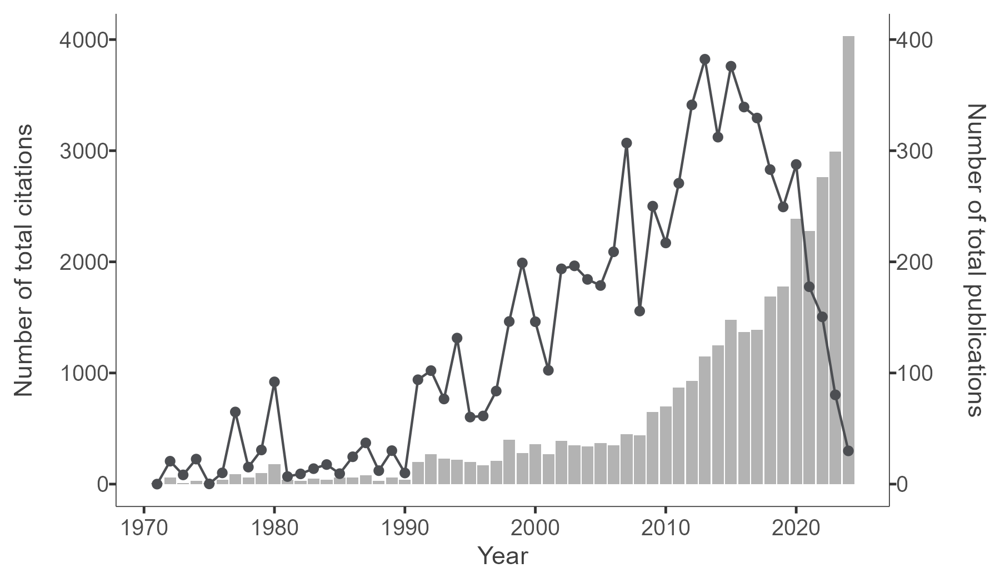

```{r setup, include=FALSE}
knitr::opts_chunk$set(echo = TRUE, warning = FALSE)
```

```{=html}
<style>
  .responsive-figure {
    width: 100% !important;
    height: auto;
  }
</style>
```

# Screening

### Extract Web of Science (WoS) Data

```{r}
#| code-fold: false
suppressPackageStartupMessages({
  library(knitr)
  library(readxl)
  library(DT)
  library(bibliometrix)
  library(plyr)
  library(dplyr)
  library(tidyr)
  library(ggplot2)
  library(stringr)
  library(openxlsx)
  library(sf)
  library(rnaturalearth)
  library(ggrepel)
  library(ggiraph)
})

```

### Import Wos Data

```{r, eval=FALSE}
#| code-fold: false
wos_1_500 <- convert2df("1_500.ciw", dbsource = "wos", format = "endnote")
wos_501_1000 <- convert2df("501_1000.ciw", dbsource = "wos", format = "endnote")
wos_1001_1500 <- convert2df("1001_1500.ciw", dbsource = "wos", format = "endnote")
wos_1501_2000 <- convert2df("1501_2000.ciw", dbsource = "wos", format = "endnote")
wos_2001_2500 <- convert2df("2001_2500.ciw", dbsource = "wos", format = "endnote")
wos_2501_3000 <- convert2df("2501_3000.ciw", dbsource = "wos", format = "endnote")
wos_3001_3500 <- convert2df("3001_3500.ciw", dbsource = "wos", format = "endnote")
wos_3501_4000 <- convert2df("3501_4000.ciw", dbsource = "wos", format = "endnote")
wos_4001_4500 <- convert2df("4001_4500.ciw", dbsource = "wos", format = "endnote")
wos_4501_4860 <- convert2df("4501_4860.ciw", dbsource = "wos", format = "endnote")
```

```{r, echo=FALSE, eval=FALSE}
wos_4860 <- rbind.fill(
  wos_1_500,
  wos_501_1000,
  wos_1001_1500,
  wos_1501_2000,
  wos_2001_2500,
  wos_2501_3000,
  wos_3001_3500,
  wos_3501_4000,
  wos_4001_4500,
  wos_4501_4860)
```

### Text Classification and Prediction

#### **`Step 1. Text classifition for using single case design`** [Code](screening_single_case/index.html)

**Figure 1. Single Case Design Classification**


#### **`Step 2. Text classification for using technology`** [Code](screening_technology_use/index.html)

**Figure 2. Technology Use Classification**


#### **`Step 3. Filtering studies including methodology content`** [Code](methodology/index.html)

-   Employed a list of **77 wild expressions**, composed with **regular expressions** to process the data.

# Bibliometrics

### Total Publications and Citations

```{r, eval=FALSE}
data <- read.xlsx("../data/all_data.xlsx")

data <- data %>% filter(data$filtered == "Yes")
  
data_descriptive <- data %>%
    mutate(Study = paste("study", row_number(), sep = "")) %>%
    mutate(document = paste(Study, PY, sep = "_")) %>% 
    ungroup()

data_descriptive <- data_descriptive %>% 
    dplyr::select(document, everything())

year_doc <- data_descriptive %>%
  group_by(PY) %>%
  summarize(publication_number = n()) %>%
  ungroup()

year_TC <- data_descriptive %>%
    group_by(PY) %>%
    summarize(total_citation = sum(TC)) %>%
    ungroup()

year_doc_counts_all <-  left_join(year_doc, year_TC, by = "PY")

year_citation_plot <- year_doc_counts_all %>%
    ggplot() +
    geom_col(aes(PY, publication_number*10), fill = "#B3B3B3") +
    geom_line(aes(PY, total_citation), size = 0.5, color="#4C4E52") +
    geom_point(aes(PY, total_citation), size = 1.5, color = "#4C4E52") +
    scale_y_continuous(sec.axis = sec_axis(~./10, name = "Number of total publications")) +
    labs(x = "Year", y = "Number of total citations", fill = "") +
    theme_classic(base_size = 12) +
        theme(
        axis.line = element_line(color = "#404040", size = 0.2),
        axis.title = element_text(size = 11, color = "#404040"),
        axis.text.y.left = element_text(margin = margin(l = 7)),
        axis.text.y.right = element_text(margin = margin(r = 10))
)

ggsave('../figures/year_citation_plot.png',
       width = 6, height = 3.5, dpi = 300, plot = year_citation_plot)

year_source_type <- data_descriptive %>%
    mutate(study_number = row_number()) %>%
    group_by(SO) %>%
    summarize(publication_number = nrow(data.frame(study_number))) %>% 
    ungroup()

year_doc_counts <- data_descriptive %>%
    mutate(study_number = row_number()) %>%
    group_by(PY) %>%
    summarize(publication_number = n()) %>%
    ungroup()

year_1990s <- data_descriptive %>% 
    filter(PY >=1990 & PY <= 1999) %>%
    summarize(publication_number = n()) %>%
    ungroup()

year_2000s <- data_descriptive %>% 
    filter(PY>=2000 & PY <= 2009) %>%
    summarize(publication_number = n()) %>%
    ungroup()

year_2010s_plus <- data_descriptive %>% 
    filter(PY >=2010 & PY <= 2022) %>%
    summarize(publication_number = n()) %>%
    ungroup()
```

**Figure 3**



### Main Findings

```{r, eval=FALSE}
data_descriptive$DT <- case_when(
   data_descriptive$DT == "ARTICLE" ~ "Article",
    data_descriptive$DT == "BOOK CHAPTER" ~ "Book Chapter",
    data_descriptive$DT == "ARTICLE; BOOK CHAPTER" ~ "Book Chapter",
    data_descriptive$DT == "REVIEW; BOOK CHAPTER" ~ "Book Chapter",
    data_descriptive$DT == "ARTICLE; DATA PAPER" ~ "Article",
    data_descriptive$DT == "EARLY ACCESS" ~ "Early Access",
    data_descriptive$DT == "ARTICLE; EARLY ACCESS" ~ "Article",
    data_descriptive$DT == "REVIEW; EARLY ACCESS" ~ "Review",
    data_descriptive$DT == "PROCEEDINGS PAPER" ~ "Proceeding Paper",
    data_descriptive$DT == "ARTICLE; PROCEEDINGS PAPER" ~ "Article",
    data_descriptive$DT == "REVIEW" ~ "Review",
    data_descriptive$DT == "EDITORIAL MATERIAL" ~ "Editorial Material",
    data_descriptive$DT == "MEETING ABSTRACT" ~ "Meeting Abstract",
    TRUE ~ as.character(data_descriptive$DT)
)

source_hindex <- bibliometrix::Hindex(data_descriptive, years = Inf, field = "source")$H
source_hindex$SO <- source_hindex$Element
source_hindex$m_index <- round(source_hindex$m_index, 2) 

source_TC <- data_descriptive %>% 
    group_by(SO) %>%
    summarize(total_citation = sum(TC)) %>%
    mutate(total_citation_per = round((total_citation / sum(total_citation) * 100),2)) %>%
    ungroup()

source_TP <- data_descriptive %>% 
    group_by(SO) %>%
    summarize(publication_number = n()) %>%
    mutate(publication_number_per = round((publication_number / sum(publication_number) * 100),2)) %>%
    ungroup()

source_detail <- left_join(source_TC, source_TP, by = "SO")

source_detail <- source_detail %>% arrange(desc(total_citation), desc(publication_number))
 
source_combined <- left_join(source_detail, source_hindex, by = "SO")

source_combined <- source_combined %>%
    arrange(desc(total_citation), desc(publication_number)) 

write.xlsx(source_combined, file = "../results/summary/source_combined.xlsx", colNames = TRUE)

results <- biblioAnalysis(data_descriptive)

descriptive_summary <- summary(results, k=71, pause=F, width=130)

MainInformationDF <- descriptive_summary$MainInformationDF 
write.xlsx(MainInformationDF, file = "../results/summary/MainInformationDF.xlsx", colNames = TRUE)

MostProdCountries <- descriptive_summary$MostProdCountries
write.xlsx(MostProdCountries, file = "../results/summary/MostProdCountries.xlsx", colNames = TRUE)
```

```{r, echo=FALSE}
MainInformationDF <- read_excel("files/MainInformationDF.xlsx")
datatable(MainInformationDF, options = list(pageLength = 10))
```

# World Map

### Total Citations and Publications

```{r, eval=FALSE}
MostProdCountries$Articles <- as.numeric(MostProdCountries$Articles)
MostProdCountries$Freq <- as.numeric(MostProdCountries$Freq)
MostProdCountries$SCP <- as.numeric(MostProdCountries$SCP)
MostProdCountries$MCP <- as.numeric(MostProdCountries$MCP)
MostProdCountries$MCP_Ratio <- as.numeric(MostProdCountries$MCP_Ratio)
TCperCountries$`Total Citations` <- as.numeric(TCperCountries$`Total Citations`)
TCperCountries$`Average Article Citations` <- as.numeric(TCperCountries$`Average Article Citations`)
colnames(TCperCountries) <- trimws(colnames(TCperCountries))

Countries_Prod_TC <- left_join(MostProdCountries, TCperCountries, by = "Country")

Countries_Prod_TC$Country <- stringr::str_trim(Countries_Prod_TC$Country, "both")

Countries_Prod_TC$Country <- stringr::str_to_title(Countries_Prod_TC$Country)

Countries_Prod_TC <- Countries_Prod_TC %>% 
    mutate(Country = case_when(
      Country == "Usa" ~ "USA",
        Country == "Korea" ~ "South Korea",
        Country == "U Arab Emirates" ~ "UAE",
        Country == "United Kingdom" ~ "UK",
        TRUE ~ as.character(Country)
    ))

write.xlsx(Countries_Prod_TC, file = "../results/summary/Countries_Prod_TC.xlsx", colNames = TRUE)

# Disable spherical geometry
sf::sf_use_s2(FALSE)

# Obtain country boundaries with small scale
world <- ne_countries(scale = "small", returnclass = "sf")

world <- world %>% 
  mutate(admin = case_when(
    admin == "United States of America" ~ "USA",
    admin == "United Arab Emirates" ~ "UAE",
    admin == "United Kingdom" ~ "UK",
    admin == "United Republic of Tanzania" ~ "Tanzania",
    admin == "Republic of Serbia" ~ "Serbia",
    TRUE ~ as.character(admin)
  ))

wintr_proj <- "+proj=wintri +datum=WGS84 +no_defs +over"

world_projected <- lwgeom::st_transform_proj(world, crs = wintr_proj)

# Calculate centroids in the projected CRS
centroids_projected <- st_centroid(world_projected)

centroids_geo <- st_transform(centroids_projected, crs = st_crs(world))

world_centroids <- cbind(world, st_coordinates(centroids_geo))

world_joined <- left_join(world, Countries_Prod_TC, by = c("admin" = "Country"))

world_joined_filtered <- world_joined %>% filter(!is.na(Articles))

world_joined_filtered <- world_joined_filtered %>%
  mutate(country_article = paste(admin, Articles))

world_sf <- st_as_sf(world_joined_filtered, coords = c("longitude", "latitude"), crs = "+proj=longlat +datum=WGS84 +ellps=WGS84 +towgs84=0,0,0")

b <- c(200, 2000, 5000, 10000, 20000, 40000, 60000, 70000)

# Create the world map with centroids and labels
world_map <- world_sf %>%
  ggplot() +
  geom_sf_interactive(aes(fill = `Total Citations`, 
                          tooltip = paste("TC: ", admin, `Total Citations`)), 
                      size = 0.25) +
  geom_label_repel(
    size = 3.3,
    aes(geometry = geometry, label = admin),
    alpha = 0.7,
    max.overlaps = 13,
    stat = "sf_coordinates",
    font_size = 3.3
  ) +
  scale_fill_viridis_c(option = "viridis", trans = "sqrt", na.value = "white", breaks = b, direction = -1) +
  geom_point_interactive(
    aes(size = Articles,
        geometry = geometry,
        tooltip = paste("TP: ", admin, Articles)),
    color = "#CC5500",
    shape = 21,
    stat = "sf_coordinates",
    stroke = 0.5
  ) +
  theme_void() +
  theme(
    legend.position = "bottom",
    legend.direction = "horizontal",
    legend.title = element_text(size = 11),
    legend.text = element_text(size = 10)
  ) +
  labs(fill = "Total citations (TC)", size = "Total publications (TP)") +
  guides(
    fill = guide_colourbar(title.position = "top", title.hjust = 0.5, barwidth = 18, barheight = 1),
    size = guide_legend(title.position = "top", title.hjust = 0.5)
  )

world_map_interactive <- girafe(ggobj = world_map, width_svg = 10, height_svg = 5) %>%
    girafe_options(
    opts_hover(css = "fill:cyan;"),
    opts_sizing(rescale = TRUE),
    css = "div.girafe-container { padding-top: 0px; margin-top: -20px; }
           .ggiraph-toolbar { position: absolute; bottom: 10px; right: 10px; }"
  )

htmlwidgets::saveWidget(
  widget = world_map_interactive, 
  file = "world_map_interactive/index.html",
  selfcontained = TRUE)
```

[Figure 4](world_map_interactive/index.html)

```{r, echo=FALSE}
load("files/world_map_interactive.Rdata")
world_map_interactive
```

# Topic Modeling

### Stetps of Employing Large Language Models

[Code](topic_modeling/index.html)

[Figure 5](topic_modeling/fig_cluster.html) <iframe src="topic_modeling/fig_cluster.html" width="800" height="600"></iframe>

[Figure 6](topic_modeling/topic_model_fig.html) <iframe src="topic_modeling/topic_model_fig.html" width="800" height="600"></iframe>

[Figure 7](topic_modeling/topic_word_barchart.html) <iframe src="topic_modeling/topic_word_barchart.html" width="800" height="900"></iframe>

[Figure 8](topic_modeling/docs_topics.html) <iframe src="topic_modeling/docs_topics.html" width="800" height="600"></iframe>

[Figure 9](topic_modeling/heatmap.html) <iframe src="topic_modeling/heatmap.html" width="800" height="600"></iframe>

[Figure 10](topic_modeling/hierarchical_topics_fig.html) <iframe src="topic_modeling/hierarchical_topics_fig.html" width="800" height="600"></iframe>

# N-grams

### Visualization of N-grams Usage

[Figure 11](topic_modeling/ngram_count_fig.html) <iframe src="topic_modeling/ngram_count_fig.html" width="800" height="800"></iframe>

[Figure 12](topic_modeling/ngram_proportion_fig.html) <iframe src="topic_modeling/ngram_proportion_fig.html" width="800" height="800"></iframe>

# Word Networks

**Figure 13** <https://scd-network.dev>

<iframe src="https://scd-network.dev" width="800" height="1000">

</iframe>
